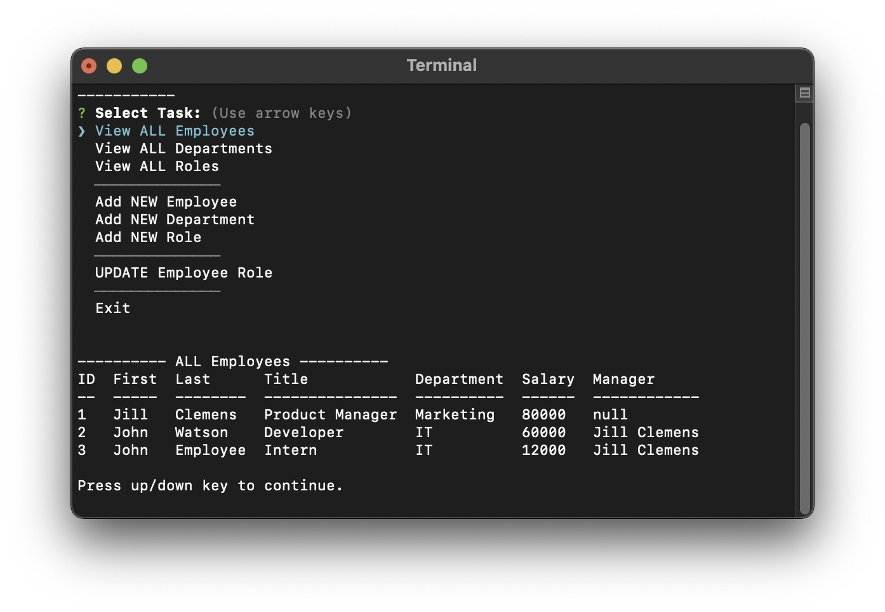

# Employee Tracker v0.9
  Video demo: <a href="http://www.meetdru.com/files/employee-tracker">http://www.meetdru.com/files/employee-tracker</a>

  
  ## Description
  A command-line app that demonstrates proficiency in basic SQL queries, dynamic UI lists, and asynchronous function essentials.
  
  ## Next Version
  - Add validators to user inputs.
  - Add delete functionality.
  - I ended up mixing different styles of JS in my effort to make this functional. I plan to refactor the code.
  - I also plan to test using the inquirer reactive interface functionality.
 
 
  ## License
  Use of this project is subject to the terms and conditions of the <a href="https://www.mit.edu/~amini/LICENSE.md">MIT License</a>.
  ## Questions
  - Please email any questions to: <a href="mailto:dru.ludwig-github@yahoo.com">dru.ludwig-github@yahoo.com</a>
  - Find me on GitHub: <a href="https://github.com/druludwig">druludwig</a>
  
## Screenshot

